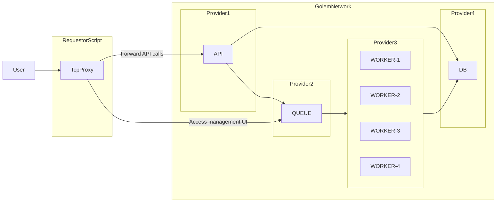

# Golem Network based Decentralized Computer

<!-- TOC -->
* [Golem Network based Decentralized Computer](#golem-network-based-decentralized-computer)
  * [About this project](#about-this-project)
  * [Project structure](#project-structure)
    * [The `application` workspace](#the-application-workspace)
    * [The `golem-requestor` workspace](#the-golem-requestor-workspace)
    * [Architecture diagram](#architecture-diagram)
  * [Building and usage](#building-and-usage)
    * [The `application`](#the-application)
      * [Building](#building)
      * [Usage](#usage)
    * [The `golem-requestor` script](#the-golem-requestor-script)
      * [Building](#building-1)
      * [Usage](#usage-1)
  * [Building for Golem Registry](#building-for-golem-registry)
<!-- TOC -->

## About this project

This project has been prepared for the ETH Warsaw 2024 workshop titled _Harnessing Golem Network's Compute Power_. It
means to showcase an N-tier application (PostgreSQL) consisting out of a database, message queue (RabbitMQ), an API
access layer and layer of workers performing tasks which are distributed via the queue system.

## Project structure

This project leverages NPM workspaces to maintain two logically separate components of the "Decentralized Computer
Solution".

### The `application` workspace

Contains the core application itself. It's an app that follows the 12-factor application principles and defines two
process types: `api` and `worker` within the same codebase.

The general responsibility separation works this way:

- The API interacts with the database to define work items, and schedules their execution via the queue system.
- The workers pick up the work item from the queue, retrieve necessary details from the DB and perform the task to
  completion, saving the results back to the database.

The project can be built and be tested locally using `docker compose` - the respective `docker-compose.yml` reside in
that workspace.

### The `golem-requestor` workspace

Contains the _requestor script_ for the project which:

1. Acquires and pays compute resources from the Golem Network
2. Orchestrates deployment of solution components into the rented infrastructure including VPN network formation
3. Manages configuration environment variables to ensure that the components get the right inputs
4. Acts as a Proxy to implement _inbound_ access to the REST API of the `api` process.

In essence, this project's aim is to _ensure that it runs on Golem Network_.

### Architecture diagram

The following diagram depicts the general architecture.



## Building and usage

### The `application`

#### Building

```bash
# Clone the code
git clone https://github.com/golemfactory/eth-warsaw-dc-app.git
cd eth-warsaw-dc-app

# Install packages
npm install

# Start the project in docker
cd workspaces/application
docker compose build
docker compose up -d

# Populate DB with schema from ORM models
docker compose exec api bash -c "npm run db:schema:sync"
```

#### Usage

You can now request a calculation via the API exposed on your local machine:

```bash
curl -X POST -d '{"a":1, "b":1}' -H 'Content-Type: application/json' http://localhost:8080/add | jq
```

And retrieve the list of results

```bash
curl -H 'Content-Type: application/json' http://localhost:8080/results | jq
```

### The `golem-requestor` script

> ⚠ IMPORTANT ⚠
>
> Make sure that you stopped the `docker-compose` project first before you run the requestor script to not encounter "port taken" issues.

#### Building

```bash
cd workspaces/golem-requestor

echo 'YAGNA_APPKEY=ec90...20e3' > .env
npm run build
npm start
```

#### Usage

The script will expose the REST API and RabbitMQ Management UI:

* [http://localhost:8080]() - the API service exposed on requestor
* [http://localhost:15672]() - RabbitMQ management UI, login credentials `guest/guest`

You can now use the same `curl` commands like in the docker-compose example, but this time these will be executed by the processes running on Golem Network.

## Building for Golem Registry

If you wish to build and push the `application` into the Golem Registry to use it with the `golem-requestor` script:

### Registration to Golem Registry required

If you want to publish your images to the Golem Registry, you need to have an account a https://registry.golem.network. Once you register, navigate to `Settings` and create a _Personal Access Token_ - you will use it together with your account name (registry username) to publish the images.

In the `Repostories` tab, create a new repository to which the image will be uploaded. The name you provide will be used to build the image name from `your-username/new-repository-name`.

Given you have your:
- registry username
- personal access token
- name of the repository

We can use the `golem-network` toolkit to build the image:

```bash
cd workspaces/application

# Produces `grisha-golem/decentralized-computer:latest` image
docker compose build

# Use that image in the next step
# export REGISTRY_USER=your-username
# export REGISTRY_TOKEN=***
gvmkit-build build grisha-golem/decentralized-computer:latest --push
```