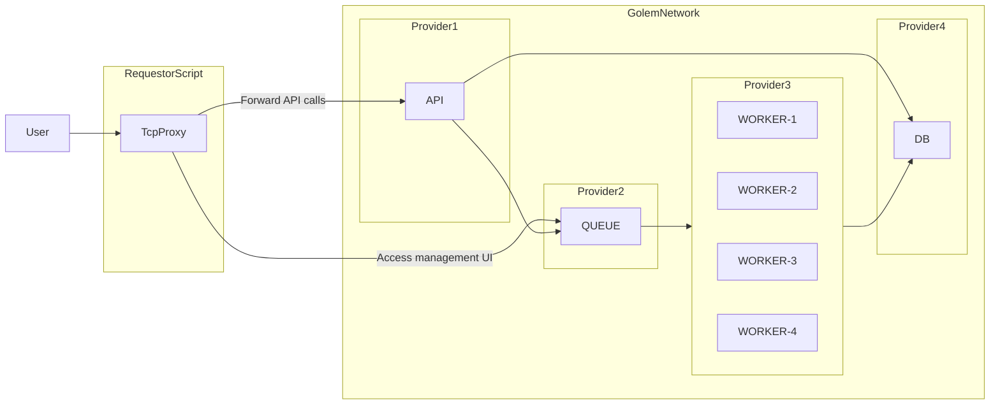

# Golem Network based Decentralized Computer

<!-- TOC -->
* [Golem Network based Decentralized Computer](#golem-network-based-decentralized-computer)
  * [About this project](#about-this-project)
  * [Project structure](#project-structure)
    * [The `application` workspace](#the-application-workspace)
    * [The `golem-requestor` workspace](#the-golem-requestor-workspace)
    * [Architecture diagram](#architecture-diagram)
  * [Building and running](#building-and-running)
    * [The `application`](#the-application)
    * [The worker script](#the-worker-script)
<!-- TOC -->

## About this project

This project has been prepared for the ETH Warsaw 2024 workshop titled _Harnessing Golem Network's Compute Power_. It
means to showcase an N-tier application (PostgreSQL) consisting out of a database, message queue (RabbitMQ), an API
access layer and layer of workers performing tasks which are distributed via the queue system.

## Project structure

This project leverages NPM workspaces to maintain two logically separate components of the "Decentralized Computer
Solution".

### The `application` workspace

Contains the core application itself. It's an app that follows the 12-factor application principles and defines two
process types: `api` and `worker` within the same codebase.

The general responsibility separation works this way:

- The API interacts with the database to define work items, and schedules their execution via the queue system.
- The workers pick up the work item from the queue, retrieve necessary details from the DB and perform the task to
  completion, saving the results back to the database.

The project can be built and be tested locally using `docker compose` - the respective `docker-compose.yml` reside in
that workspace.

### The `golem-requestor` workspace

Contains the _requestor script_ for the project which:

1. Acquires and pays compute resources from the Golem Network
2. Orchestrates deployment of solution components into the rented infrastructure including VPN network formation
3. Manages configuration environment variables to ensure that the components get the right inputs
4. Acts as a Proxy to implement _inbound_ access to the REST API of the `api` process.

In essence, this project's aim is to _ensure that it runs on Golem Network_.

### Architecture diagram

The following diagram depicts the general architecture.



## Building and running

### The `application`

```bash
# Clone the code
git clone https://github.com/golemfactory/eth-warsaw-dc-app.git
cd eth-warsaw-dc-app

# Install packages
npm install

# Start the project in docker
cd workspaces/application
docker compose build
docker compose up -d

# Populate DB with schema from ORM models
docker compose exec api bash -c "npm run db:schema:sync"
```

### The worker script

> ⚠ IMPORTANT ⚠
>
> Make sure that you stopped the `docker-compose` project first before you run the requestor script to not encounter "port taken" issues.

```bash
cd workspaces/golem-requestor

echo 'YAGNA_APPKEY=ec90...20e3' > .env
npm run build
npm start
```
